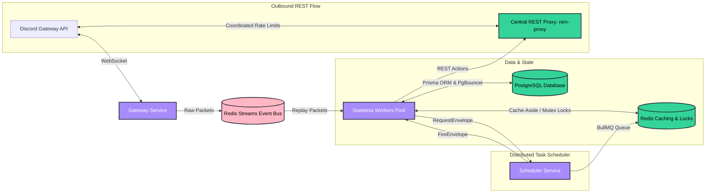

<div align="center">

# 🔥 Ember: Horizontally Scalable Modular Discord Bot Platform

### **A Production-Grade, Microservices-Based Discord Framework Built on Bun, Sapphire, and Redis Streams**

Ember is a highly optimized, state-of-the-art modular Discord bot platform. Rather than running a heavyweight monolithic process, Ember splits gateway operations, scheduled tasks, REST rate-limiting, and modular command handling into isolated, horizontally scalable microservices. It runs on the ultra-fast **Bun** runtime, utilizes the **Sapphire v5** framework, and coordinates cluster state over **Redis Streams**, **RabbitMQ**, and **PgBouncer**.

---

[](https://bun.sh)
[](https://www.sapphirejs.dev/)
[](https://www.typescriptlang.org/)
[](https://www.prisma.io/)
[](https://redis.io/)
[](https://www.rabbitmq.com/)
[](https://www.docker.com/)

**Modular Isolation • Gateway/Worker Split • Centralized Rate-Limits • Clustered Sharding • Telemetry-Guided**

</div>

---

## 📖 Table of Contents

*   [🏛️ Architecture Overview](#️-architecture-overview)
*   [📂 Monorepo Structure](#-monorepo-structure)
*   [⚡ Core Architectural Highlights](#-core-architectural-highlights)
*   [🛡️ Audited Feature Modules](#️-audited-feature-modules)
*   [🚀 Getting Started](#-getting-started)
*   [⚙️ Environment Configuration](#️-environment-configuration)
*   [📈 Telemetry & Observability](#-telemetry---observability)
*   [🛠️ Developer Scripts Reference](#️-developer-scripts-reference)
*   [⚜️ Developer Golden Mandates](#️-developer-golden-mandates)
*   [📄 License](#-license)

---

## 🏛️ Architecture Overview

Unlike traditional monolithic Discord bots that struggle under heavy concurrent events due to single-threaded event loops, Ember implements a **Wick/Dyno-class microservice topology** coordinated via Bun workspaces:



### Microservice Responsibilities:
1.  **`gateway` (`apps/gateway`)**: A zero-Sapphire, ultra-lightweight client whose sole job is maintaining Discord WebSockets, decoding gateway payloads, and publishing raw dispatches (op: 0) to **Redis Streams**. It is completely isolated and survives worker recycles.
2.  **`worker` (`apps/worker`)**: Stateless processing nodes that suppress their WebSocket connection and consume from the Redis Streams event bus, replaying raw packets into local Sapphire clients. Scales horizontally based on queue consumer lag.
3.  **`scheduler` (`apps/scheduler`)**: Owns the BullMQ worker and Redis DB 1. It orchestrates all time-based durable tasks (mutes, bans, captcha expiries) and triggers events across workers.
4.  **`api` (`apps/api`)**: Translates JSON-RPC 2.0 requests between the bot and the web dashboard over RabbitMQ.
5.  **`rest-proxy` (`nirn-proxy`)**: A centralized proxy coordinating outbound Discord REST rate limits. Every worker routes REST actions through the proxy, ensuring a shared global rate-limit bucket budget.

---

## 📂 Monorepo Structure

Ember is organized under **Bun Workspaces** to guarantee absolute boundary separation and clean code sharing:

```text
├── apps/
│   ├── api/             # JSON-RPC 2.0 Server for dashboard integration
│   ├── gateway/         # Zero-Sapphire, WS gateway publisher (TRANSPORT=streams)
│   ├── scheduler/       # BullMQ durable task coordinator
│   └── worker/          # Stateless, Sapphire-driven module handler
├── packages/
│   ├── contracts/       # Shared TypeScript RPC and Bus schemas (zero runtime deps)
│   ├── core/            # Core framework glue, module registry, and repositories
│   ├── event-bus/       # Redis Streams consumer group and in-proc transport
│   ├── observability/   # Prometheus metrics server and OpenTelemetry tracing
│   ├── sdk/             # Public SDK for loading external modules
│   └── sharding/        # Bucketed IDENTIFY cluster coordinator & session manager
├── config/              # Grafana, Tempo, Prometheus, and OTel collector configs
├── prisma/              # Schema definition fronted by PgBouncer transaction pooling
└── scripts/             # Chaos injection, load-testing, and manifest generators
```

---

## ⚡ Core Architectural Highlights

*   **Redis Streams Event Bus**: Utilizes `XADD`, `XREADGROUP`, and `XACK` with consumer groups for horizontals workers. Runs a background `XAUTOCLAIM` loop to claim stale unacknowledged messages (fault-tolerance) and routes failures to a Dead Letter Queue (DLQ) after 5 failed deliveries.
*   **Distributed Mutex Locking**: Per-process memory locks are replaced by a **Redis Distributed Lock** engine (`SET NX PX` with Lua-fenced releases), ensuring mutual exclusion on guild configurations and state modifications across multiple worker replicas.
*   **Consensus-Driven Sharding Coordinator**: Gateway instances join a Redis-backed cluster (`ember:cluster:<name>:members`), maintaining heartbeats via ZSETs. A temporary cluster leader is elected using a Redis lock to partition shard ranges evenly among active replicas, minimizing session churn during scaling.
*   **Redis Session Resumption**: Persists `SessionInfo` globally in Redis (`ember:cluster:<name>:session:<shard>`) with a 1s batch flushing loop. Shards take over other processes' sessions and `RESUME` seamlessly without burning Discord `IDENTIFY` quotas.
*   **Centralized Outbound REST Gating**: Routes outbound REST through a central proxy, disabling local discord.js limiters (`globalRequestsPerSecond: Infinity`) to eliminate double-throttling latency while guarding against CloudFlare bans.

---

## 🛡️ Audited Feature Modules

Each module lives in `packages/core/src/modules/` and is discovered *manifest-first* at runtime without early code execution, making hot-reloads and dependency resolution rock-solid.

### 🤖 Multi-Threaded Word Filter (`filter`)
*   **Facts**: Uses a highly optimized **Aho-Corasick multi-pattern search automaton**.
*   **Offloading**: Automaton compilation (`FILTER_BUILD`) and searching (`FILTER_MATCH`) are entirely offloaded to native **Bun Worker threads**, keeping the gateway event loop completely unblocked.
*   **Self-Healing**: If a worker node crashes or respawns, a cache-miss triggers an automatic broadcast rebuild across all worker threads before retrying.

### ✅ Interactive Captcha Sequence (`verify`)
*   **Facts**: Provides a highly polished **emoji-sequence math verification sequence** using Discord button components.
*   **State Control**: Captcha sequence progress, attempts remaining, and correct emoji answers are stored strictly in Redis under `VerifyKeys.seqState` with a strict `EXAT` TTL.
*   **Reliability**: A background `captcha-expiry` Sweeper sweeps inactive sessions, executing a kick action on timeout if configured.

### 🔨 Robust Moderation & GDPR Compliance (`mod`)
*   **Facts**: Features `ban`, `kick`, `timeout`, `quarantine`, and `sanitize` commands with an atomic `GuildCaseCounter` to prevent duplicate case number generation.
*   **GDPR Privacy**: Implements strict data purges (`deleteUserData`). Moderation cases are kept for audit integrity but **anonymize** both the subject's and moderator's Snowflake strings to `'0'`.
*   **State Reconciler**: Implements `reconcileScheduledJobs` on startup, checking Postgres against BullMQ to re-arm pending unmutes/unbans after downtimes.

### ⚙️ Granular RBAC Overrides (`permissions_mgr`)
*   **Facts**: Extends Sapphire's `AllFlowsPrecondition` to check permission overrides per command path and guild.
*   **Priority Chain**: Overrides are evaluated in a strict precedence order:
    $$\text{User Overrides} > \text{Channel Overrides} > \text{Category Overrides} > \text{Role Position (Highest first)} > \text{@everyone}$$

---

## 🚀 Getting Started

### Option A: Docker Compose (Recommended)
Docker Compose boots the entire microservices cluster, databases, telemetry collectors, and proxies on your local machine with a single command.

1.  **Clone the Repository**:
    ```bash
    git clone https://github.com/ember-hq/bot.git
    cd bot
    ```
2.  **Configure Environment**:
    ```bash
    cp .env.example .env
    # Supply your Discord BOT_TOKEN and CLIENT_ID
    ```
3.  **Start in Development Mode** (Hot-reloads on file changes):
    ```bash
    docker compose up
    ```
4.  **Start in Production Mode** (Autoscales workers, enables PgBouncer transaction pooling):
    ```bash
    docker compose --profile production up -d
    ```

### Option B: Bare-Metal Setup
Requires **Bun (v1.1+)**, **PostgreSQL (v16)**, and **Redis (v7)** running locally.

1.  **Install Workspaces**:
    ```bash
    bun install
    ```
2.  **Generate Client & Push Database Schema**:
    ```bash
    bun run db:generate
    bun run db:push
    ```
3.  **Run Worker**:
    ```bash
    bun run dev
    ```

---

## ⚙️ Environment Configuration

Ember strictly validates all variables at boot. Below are the key environment configurations:

### 🔑 Authentication & Core
*   `BOT_TOKEN`: Discord Bot Token.
*   `CLIENT_ID`: Discord Application Client ID.
*   `OWNER_IDS`: Comma-separated list of Bot Owner Discord User IDs.
*   `EMBER_ROLE`: The role of this process (`monolith` | `gateway` | `worker` | `scheduler`).
*   `TRANSPORT`: The event bus driver (`inproc` | `streams`).

### 🛢️ Services & Proxies
*   `POSTGRES_URL`: Connection string for the PostgreSQL database (should point to PgBouncer port `6432` in production).
*   `DIRECT_POSTGRES_URL`: Direct PostgreSQL connection bypass string (required for Prisma migrations).
*   `REDIS_HOST` / `REDIS_PORT` / `REDIS_PASSWORD`: Credentials for the Redis database.
*   `DISCORD_PROXY_URL`: Centralized rate-limit proxy base address (e.g. `http://nirn-proxy:8080`).

---

## 📈 Telemetry & Observability

Ember features a production-grade observability stack scraped via `/metrics` (Port `9090`):

*   **RED metrics**: Tracks command rate, error rates, and duration histograms.
*   **Queue Lag**: Exposes `ember_stream_length`, `ember_stream_consumer_lag{stream,group}`, and `ember_stream_dlq_length` to trigger alerts on worker backlog surges.
*   **REST Gating Metrics**: Gauges `ember_rest_retry_after_seconds` and `ember_rest_invalid_request_warnings_total` to track rate limit trends.
*   **OpenTelemetry Tracing**: Integrates W3C context propagation across the Redis event bus, mapping a single command span across gateway, streams, and worker completion.

---

## 🛠️ Developer Scripts Reference

Use these scripts during development and deployment:

| Command | Action | Scope |
| :--- | :--- | :--- |
| `bun run dev` | Runs the active app in hot-reloading watch mode | Workspace |
| `bun run typecheck` | Validates TypeScript compilation across the monorepo | Workspace |
| `bun run lint` | Runs strict ESLint checks and formats the files | Workspace |
| `bun run db:migrate` | Creates a production-grade SQL schema migration | Database |
| `bun run db:studio` | Launches a local database GUI explorer | Database |
| `bun run modules:manifest` | Generates static `manifest.json` files for modules | Framework |
| `bun test` | Runs the Vitest test suite | Test |

---

## ⚜️ Developer Golden Mandates

To contribute or write custom extensions for Ember, you **MUST** follow these core guidelines:

1.  🚫 **No direct `EmbedBuilder` calls**: Build user-facing output through the card factories in `packages/core/src/utilities/cards.ts` (e.g. `makeSuccessCard`, `makeErrorCard`) rather than constructing embeds directly.
2.  🛢️ **No direct `prisma` calls in modules**: All database access in modules must route through `this.container.db.<repository>` (`packages/core/src/prisma/repositories/`).
3.  📦 **Respect isolation boundaries**: Code in `src/modules/{name}/` must not import from a sibling module. Shared code belongs in `packages/core/src/core/` or `packages/core/src/utilities/`.
4.  ⚡ **Command registration**: User-facing features register as slash commands (grouped where it makes sense, e.g. `/permissions set`). Prefix commands are reserved for bot-owner admin utilities.

---

## 📄 License

This project is licensed under the **Apache License 2.0**.

Under this license, you are free to use, modify, distribute, and commercially exploit the codebase. However, per **Section 6 (Trademarks)**, this license does **NOT** grant you permission to use the "Ember" brand, trademarks, logos, or product names. Any modified or redistributed versions of this software **must be completely renamed and rebranded**.

---

<div align="center">
  <p>Engineered with ❤️ by the Ember Core Team.</p>
</div>
