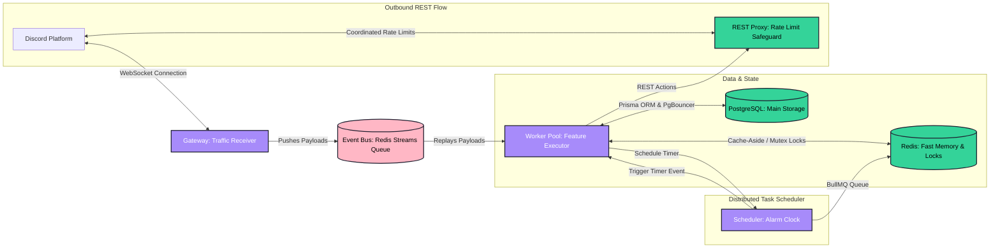

<div align="center">

# ✨ Lumi: Horizontally Scalable Modular Discord Bot Platform

### **A Production-Grade, Microservices-Based Discord Framework Built on Bun, Sapphire, and Redis Streams**

Lumi (formerly Ember) is a highly optimized, state-of-the-art modular Discord bot platform. Rather than running a heavyweight monolithic process, Lumi splits gateway operations, scheduled tasks, REST rate-limiting, and modular command handling into isolated, horizontally scalable microservices. It runs on the ultra-fast **Bun** runtime, utilizes the **Sapphire v5** framework, and coordinates cluster state over **Redis Streams**, **RabbitMQ**, and **PgBouncer**.

---

[](https://bun.sh)
[](https://www.sapphirejs.dev/)
[](https://www.typescriptlang.org/)
[](https://www.prisma.io/)
[](https://redis.io/)
[](https://www.rabbitmq.com/)
[](https://www.docker.com/)

**Modular Isolation • Gateway/Worker Split • Centralized Rate-Limits • Clustered Sharding • Telemetry-Guided**

</div>

---

## 📖 Table of Contents

*   [🏛️ Architecture Overview](#️-architecture-overview)
*   [📂 Monorepo Structure](#-monorepo-structure)
*   [⚡ Core Architectural Highlights](#-core-architectural-highlights)
*   [🛡️ Audited Feature Modules](#️-audited-feature-modules)
*   [🚀 Getting Started](#-getting-started)
*   [⚙️ Environment Configuration](#️-environment-configuration)
*   [📈 Telemetry & Observability](#-telemetry---observability)
*   [🛠️ Developer Scripts Reference](#️-developer-scripts-reference)
*   [⚜️ Developer Golden Mandates](#️-developer-golden-mandates)
*   [📄 License](#-license)

---

## 🏛️ Architecture Overview

Unlike traditional monolithic Discord bots that struggle under heavy concurrent events due to single-threaded event loops, Lumi implements a **Wick/Dyno-class microservice topology** coordinated via Bun workspaces:



---

### 📦 Microservice Responsibilities (Explained Simply)

To make Lumi ultra-reliable, we split it into five isolated services. Here is what they do technically, and what that means for your server in plain English:

1.  **`gateway` (`apps/gateway`)**
    *   **Plain English (The "Traffic Officer")**: Always stays active listening for events from Discord (like messages or joins). Even if the rest of the bot has to restart or updates code, the officer stays online, meaning **the bot never drops offline or misses an event.**
    *   **Developer Info**: Zero-Sapphire, WS gateway publisher (`TRANSPORT=streams`).
2.  **`worker` (`apps/worker`)**
    *   **Plain English (The "Worker Bees")**: Does the actual work (like running filters, moderation, and command responses). If a massive rush of users joins, we can simply spin up more worker bees to divide the load, making **command responses instant under heavy traffic.**
    *   **Developer Info**: Stateless, Sapphire-driven module handler.
3.  **`scheduler` (`apps/scheduler`)**
    *   **Plain English (The "Durable Alarm Clock")**: Manages delayed actions like a 1-hour mute or a 5-minute verification captcha expiry. If the entire server crashes or restarts, **the alarm clock remembers the exact second to unmute users on boot.**
    *   **Developer Info**: BullMQ scheduler-as-a-service.
4.  **`api` (`apps/api`)**
    *   **Plain English (The "Dashboard Bridge")**: Safely translates configurations made on your web dashboard straight to the bot processes in real-time.
    *   **Developer Info**: JSON-RPC 2.0 broker over RabbitMQ.
5.  **`rest-proxy` (`nirn-proxy`)**
    *   **Plain English (The "Rate Limit Shield")**: Discord restricts how fast a bot can talk. The rate limit shield coordinates all bot actions through a single choke point, ensuring **your bot never gets blocked or banned by Discord for talking too fast.**
    *   **Developer Info**: Outbound REST bucket coordinator.

---

## ⚡ Core Architectural Highlights

*   **Redis Streams Event Queue**: *What this means*: If a worker crashes mid-task, other workers automatically pick up the task where it left off (zero lost actions). *Technical*: Utilizes `XADD`/`XREADGROUP` consumer groups with `XAUTOCLAIM` stale-claiming.
*   **Redis Distributed Mutex Locks**: *What this means*: Prevents dual-action bugs (like accidentally charging a user's wallet twice or generating duplicate case numbers). *Technical*: Implements `SET NX PX` Redis locks with Lua-fenced releases.
*   **Consensus-Driven Sharding Coordinator**: *What this means*: Gateway replicas automatically coordinate who manages which server groups. If one gateway replica dies, the others instantly share the workload without any server downtime. *Technical*: Heartbeat-driven cluster coordinator utilizing ZSET structures.
*   **Smart Database Pooling (PgBouncer)**: *What this means*: Shares database connection slots efficiently so the system never clogs up or runs out of database handles during massive traffic spikes. *Technical*: Frontend transaction-mode pooling.

---

## 🛡️ Audited Feature Modules

### 🤖 Multi-Threaded Word Filter (`filter`)
*   **Non-Developer Benefit**: An ultra-fast word filter that scans messages for blocked words in a single glance. It operates in the background, meaning **it never lags the bot's normal chat interactions, even on massive 100,000-user servers.**
*   **Technical Implementation**: Uses an optimized **Aho-Corasick multi-pattern search automaton** offloaded to native **Bun Worker threads**, running background compilation and match actions with self-healing cache-miss recovery.

### ✅ Interactive Captcha Sequence (`verify`)
*   **Non-Developer Benefit**: Gated captcha verification for new members. It presents a highly polished, interactive sequence of clicking matching emojis in an exact order using Discord buttons, providing a **visually premium and highly secure way to stop automated raid bots.**
*   **Technical Implementation**: Captcha sequence progress, attempts, and emoji keys are stored in Redis under strict `EXAT` absolute time-to-live expirations, with automated `captcha-expiry` background task sweeps.

### 🔨 Robust Moderation & GDPR Anonymization (`mod`)
*   **Non-Developer Benefit**: Absolute legal safety for user privacy. If a user requests their data to be deleted under GDPR, **the bot fully purges their personal details but preserves case histories and numbers by replacing all user details with '0', keeping your moderation logs clean and intact.**
*   **Technical Implementation**: Features `ban`/`kick`/`timeout`/`quarantine` with atomic `GuildCaseCounter` generators. Integrates `deleteUserData` hooks that purge blocklists/audit ledgers while anonymizing moderation cases.

### ⚙️ Granular Role & Channel Overrides (`permissions_mgr`)
*   **Non-Developer Benefit**: Total control over who can use what. You can allow or deny specific commands for specific users, specific roles, specific channels, or entire channel categories on a highly granular basis.
*   **Technical Implementation**: Extends Sapphire's `AllFlowsPrecondition` to check overrides per command path in a strict priority precedence:
    $$\text{User Overrides} > \text{Channel Overrides} > \text{Category Overrides} > \text{Role Position (Highest first)} > \text{@everyone}$$

---

## 🚀 Getting Started

### Option A: Docker Compose (Recommended)
Docker Compose boots the entire microservices cluster, databases, telemetry collectors, and proxies on your local machine with a single command.

1.  **Clone the Repository**:
    ```bash
    git clone https://github.com/lumi-hq/bot.git
    cd bot
    ```
2.  **Configure Environment**:
    ```bash
    cp .env.example .env
    # Supply your Discord BOT_TOKEN and CLIENT_ID
    ```
3.  **Start in Development Mode** (Hot-reloads on file changes):
    ```bash
    docker compose up
    ```
4.  **Start in Production Mode** (Autoscales workers, enables PgBouncer transaction pooling):
    ```bash
    docker compose --profile production up -d
    ```

### Option B: Bare-Metal Setup
Requires **Bun (v1.1+)**, **PostgreSQL (v16)**, and **Redis (v7)** running locally.

1.  **Install Workspaces**:
    ```bash
    bun install
    ```
2.  **Generate Client & Push Database Schema**:
    ```bash
    bun run db:generate
    bun run db:push
    ```
3.  **Run Worker**:
    ```bash
    bun run dev
    ```

---

## ⚙️ Environment Configuration

Lumi strictly validates all variables at boot. Below are the key environment configurations:

### 🔑 Authentication & Core
*   `BOT_TOKEN`: Discord Bot Token.
*   `CLIENT_ID`: Discord Application Client ID.
*   `OWNER_IDS`: Comma-separated list of Bot Owner Discord User IDs.
*   `EMBER_ROLE`: The role of this process (`monolith` | `gateway` | `worker` | `scheduler`).
*   `TRANSPORT`: The event bus driver (`inproc` | `streams`).

### 🛢️ Services & Proxies
*   `POSTGRES_URL`: Connection string for the PostgreSQL database (should point to PgBouncer port `6432` in production).
*   `DIRECT_POSTGRES_URL`: Direct PostgreSQL connection bypass string (required for Prisma migrations).
*   `REDIS_HOST` / `REDIS_PORT` / `REDIS_PASSWORD`: Credentials for the Redis database.
*   `DISCORD_PROXY_URL`: Centralized rate-limit proxy base address (e.g. `http://nirn-proxy:8080`).

---

## 📈 Telemetry & Observability

Lumi features a production-grade observability stack scraped via `/metrics` (Port `9090`):

*   **RED metrics**: Tracks command rate, error rates, and duration histograms.
*   **Queue Lag**: Exposes `ember_stream_length`, `ember_stream_consumer_lag{stream,group}`, and `ember_stream_dlq_length` to trigger alerts on worker backlog surges.
*   **REST Gating Metrics**: Gauges `ember_rest_retry_after_seconds` and `ember_rest_invalid_request_warnings_total` to track rate limit trends.
*   **OpenTelemetry Tracing**: Integrates W3C context propagation across the Redis event bus, mapping a single command span across gateway, streams, and worker completion.

---

## 🛠️ Developer Scripts Reference

Use these scripts during development and deployment:

| Command | Action | Scope |
| :--- | :--- | :--- |
| `bun run dev` | Runs the active app in hot-reloading watch mode | Workspace |
| `bun run typecheck` | Validates TypeScript compilation across the monorepo | Workspace |
| `bun run lint` | Runs strict ESLint checks and formats the files | Workspace |
| `bun run db:migrate` | Creates a production-grade SQL schema migration | Database |
| `bun run db:studio` | Launches a local database GUI explorer | Database |
| `bun run modules:manifest` | Generates static `manifest.json` files for modules | Framework |
| `bun test` | Runs the Vitest test suite | Test |

---

## ⚜️ Developer Golden Mandates

To contribute or write custom extensions for Lumi, you **MUST** follow these core guidelines:

1.  🚫 **No direct `EmbedBuilder` calls**: Build user-facing output through the card factories in `packages/core/src/utilities/cards.ts` (e.g. `makeSuccessCard`, `makeErrorCard`) rather than constructing embeds directly.
2.  🛢️ **No direct `prisma` calls in modules**: All database access in modules must route through `this.container.db.<repository>` (`packages/core/src/prisma/repositories/`).
3.  📦 **Respect isolation boundaries**: Code in `src/modules/{name}/` must not import from a sibling module. Shared code belongs in `packages/core/src/core/` or `packages/core/src/utilities/`.
4.  ⚡ **Command registration**: User-facing features register as slash commands (grouped where it makes sense, e.g. `/permissions set`). Prefix commands are reserved for bot-owner admin utilities.

---

## 📄 License

This project is licensed under the **Apache License 2.0**.

Under this license, you are free to use, modify, distribute, and commercially exploit the codebase. However, per **Section 6 (Trademarks)**, this license does **NOT** grant you permission to use the "Lumi" brand, trademarks, logos, or product names. Any modified or redistributed versions of this software **must be completely renamed and rebranded**.

---

<div align="center">
  <p>Engineered with ❤️ by the Lumi Core Team.</p>
</div>
