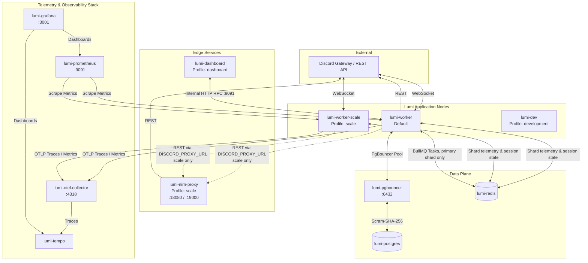

Lumi's container setup provides complete flexibility: run a single bot container against the
core data plane, or launch a fully orchestrated stack with extra worker replicas, a dashboard,
and OpenTelemetry tracing.

Every worker process is identical: `apps/worker/src/main.ts` is a lightweight discord.js
`ShardingManager` that spawns one child process per shard it owns, each child holding a real
Discord WebSocket connection and running all command, module, and interaction logic in-process.
There is no separate scheduler or gateway container — exactly one child per pod, the one holding
shard id `0`, is elected "primary" (zero-coordination, via `isPrimaryShard()`) and is the sole
owner of BullMQ job scheduling and the RPC/metrics HTTP surface. A single worker tracks its own
Discord REST rate-limit buckets; once you run more than one, the `scale` profile adds
**nirn-proxy** as a shared REST proxy so those buckets stay coordinated across processes
(`DISCORD_PROXY_URL`).

## Architecture



## Dockerfile stages

The root `Dockerfile` uses a 3-stage pipeline based on `oven/bun:1-alpine`:

```text
base (oven/bun:1-alpine) → builder (install workspace, generate Prisma) → runner (optimized runtime)
```

1. **`base`** — minimal Alpine utilities (`git`, `dumb-init`).
2. **`builder`** — copies workspace `package.json` files, source code, and Prisma schema;
   executes `bun install` + `bunx prisma generate`.
3. **`runner`** — copies built dependencies including the full `prisma/` directory and
   `prisma.config.ts`, mounts `/app/data` for add-ons, switches to unprivileged user `bun`, and
   executes production main targets.

## Services and profiles

Services are organized into distinct Compose **profiles** so you only run what you need.

| Service | Profile | Ports | Description |
| :--- | :--- | :--- | :--- |
| `worker` | *(default)* | — | Default Lumi bot process. `ShardingManager` spawns one child per shard; the primary shard (id `0`) owns BullMQ and the RPC/metrics surface. |
| `lumi-dev` | `development` | — | Interactive development container with live volume mounts and watch mode. |
| `worker-scale` | `scale` | — | Additional worker replica claiming its own shard range. |
| `dashboard` | `dashboard` | `8080:8080` | Web admin dashboard. Not working yet — see the warning below. |
| `postgres` | *(core)* | `127.0.0.1:5432:5432` | Primary database server. |
| `pgbouncer` | *(core)* | `127.0.0.1:6432:6432` | Transaction-level connection pooler. |
| `redis` | *(core)* | `127.0.0.1:6379:6379` | Entity caching and event streams. |
| `nirn-proxy` | `scale` | `127.0.0.1:18080`, `:19000` | Shared Discord REST rate-limiting proxy for multi-worker runs. |
| `otel-collector` | `observability` | `127.0.0.1:4318:4318` | OpenTelemetry Collector endpoint (OTLP HTTP). |
| `prometheus` | `observability` | `127.0.0.1:9091:9090` | Metrics collector and alerting engine. |
| `tempo` | `observability` | — | Distributed tracing storage engine. |
| `grafana` | `observability` | `127.0.0.1:3001:3000` | Metrics and trace visualization. |

## Configuration

Copy `.env.example` to `.env` in the project root before launching. The full variable reference
is generated in [Environment Variables](/docs/reference/environment-variables); the
Compose-relevant subset:

| Variable | Default | Purpose |
| :--- | :--- | :--- |
| `BOT_TOKEN` | — | Discord bot token (required). |
| `POSTGRES_USER` | `lumi` | Database username. |
| `POSTGRES_PASSWORD` | `lumi` | Database password. |
| `REDIS_PASSWORD` | `lumi` | Redis password. |
| `RPC_HTTP_PORT` | `8091` | Internal HTTP RPC port the worker binds — never published to the host. |
| `RPC_HTTP_URL` | `http://worker:8091` | RPC bridge URL the dashboard calls into the worker over. |
| `DASHBOARD_SESSION_SECRET` | — | NextAuth session JWT signing/encryption secret. |
| `DISCORD_OAUTH2_CLIENT_ID` / `_SECRET` | — | OAuth2 credentials for dashboard auth. |
| `AUTH_URL` | *(derived)* | Dashboard's externally visible origin. Only needed behind a proxy that rewrites the Host header. |
| `DISCORD_PROXY_URL` | *(empty)* | Shared Discord REST proxy endpoint. Set to `http://nirn-proxy:8080` under the `scale` profile. |
| `OTEL_ENABLED` | `true` | Enables OpenTelemetry tracing exporters. |
| `GRAFANA_PASSWORD` | `admin` | Admin password for Grafana. |

## Running it

```bash title="Default stack"
docker compose up -d
```

```bash title="Development stack, hot-reloading"
docker compose --profile development up
```

```bash title="Scaled: second worker replica"
docker compose --profile scale up -d
```

<Callout type="warn">
  The `dashboard` profile does not work yet. The shared `Dockerfile` `runner` target has no
  `next build` stage and copies source only, while the service runs `next start`, which needs a
  prebuilt `.next` — the container exits immediately with *"Could not find a production build in
  the '.next' directory"*. Run the dashboard outside Docker until that image stage exists — see
  [Dashboard](/docs/guides/dashboard).

  There is also no OAuth2 redirect-URI variable. NextAuth derives the callback from the request;
  register `<dashboard-origin>/api/auth/callback/discord` on your Discord application.
</Callout>

```bash title="Stop"
docker compose down       # stop services
docker compose down -v    # also remove persistent volume data
```

## Observability stack

```bash
docker compose --profile observability up -d
```

- **Grafana**: `http://localhost:3001` (user `admin`, password `${GRAFANA_PASSWORD:-admin}`)
- **Prometheus**: `http://localhost:9091`
- **Nirn-proxy metrics**: `http://localhost:19000`

See [Observability](/docs/deploy/observability) for what's actually instrumented.
