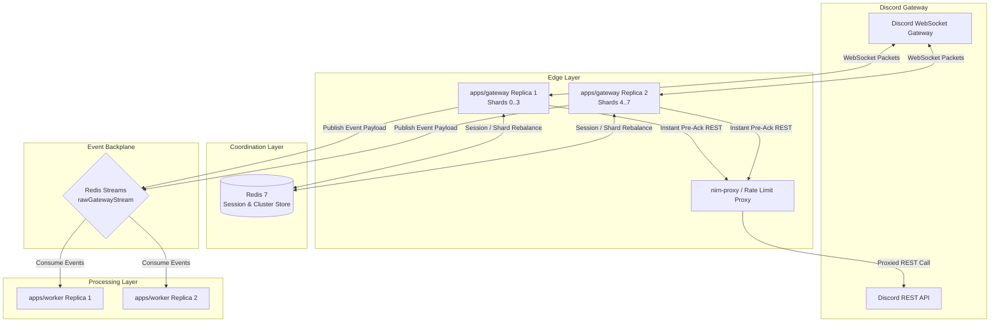

# ⚡ @lumi/gateway

<div align="center">
  
  
  
  
  
</div>

<br />

The **Lumi Gateway** (`@lumi/gateway`) is a high-performance, stateless edge service responsible for maintaining Discord WebSocket connections, managing sharding across multi-replica clusters, pre-acknowledging incoming slash command interactions, and streaming raw gateway dispatch events to the event bus backplane.

---

## 📖 Table of Contents

- [Overview](#-overview)
- [Architecture & Data Flow](#-architecture--data-flow)
- [Configuration & Environment Variables](#-configuration--environment-variables)
- [Development & Running Instructions](#-development--running-instructions)
- [Observability & Health Probes](#-observability--health-probes)

---

## 🌟 Overview

The gateway process isolates connection management from command and event logic processing:

- **Decoupled Edge Ingestion**: Holds Discord WebSocket connections using `@discordjs/ws` without loading bot commands, database connections, or command handler modules.
- **Dynamic Cluster Sharding**: Uses `@lumi/sharding` to automatically calculate shard assignments, persist session state in Redis, and execute zero-downtime shard rebalancing when scaling gateway replicas.
- **Pre-Deferred Interactions**: When `INTERACTION_DEFER_AT_GATEWAY=true`, the gateway immediately responds to incoming Discord interaction events with a pre-acknowledgment (`DeferredChannelMessageWithSource` or `DeferredMessageUpdate`) before publishing to the stream, preventing 3-second Discord interaction timeouts.
- **Rate-Limit Proxy Integration**: Connects with REST rate-limit proxies such as `nirn-proxy` (`DISCORD_PROXY_URL`) to share global REST bucket state across instances.
- **High-Throughput Event Backplane**: Publishes raw gateway envelopes (`rawGatewayStream`) to Redis Streams for consumption by worker pools.

> [!NOTE]


---

## 🏗️ Architecture & Data Flow

### Edge Processing Topology



---

## ⚙️ Configuration & Environment Variables

Configure `@lumi/gateway` using environment variables:

| Environment Variable | Required | Default | Description |
|---|:---:|:---:|---|
| `BOT_TOKEN` | **Yes** | - | Discord Bot Token from the Discord Developer Portal. |
| `LUMI_ROLE` | **Yes** | `gateway` | Identifies the process role (`gateway`). |
| `LUMI_CLUSTER_NAME` | No | - | Cluster identifier for multi-replica sharded gateway deployments. |
| `LUMI_CONSUMER_ID` | No | `gateway-1` | Unique replica identifier within the cluster (defaults to hostname/pid). |
| `INTERACTION_DEFER_AT_GATEWAY` | No | `true` | When `true`, gateway sends immediate pre-acknowledgments to Discord interactions. |
| `DISCORD_PROXY_URL` | No | - | Optional base URL of a `nirn-proxy` REST proxy (e.g. `http://nirn-proxy:8080`). |
| `EVENT_STREAM_MAXLEN` | No | `100000` | Capped length limit for Redis Streams queues. |
| `REDIS_HOST` | No | `localhost` | Redis server hostname. |
| `REDIS_PORT` | No | `6379` | Redis server network port. |
| `REDIS_PASSWORD` | No | - | Redis authentication password. |
| `REDIS_CACHE_DB` | No | `0` | Redis database index for cluster state and session storage. |
| `METRICS_ENABLED` | No | `true` | Enables HTTP metrics and health check server. |
| `METRICS_PORT` | No | `9090` | Network port for Prometheus metrics and health probes. |

> [!TIP]
> Setting `INTERACTION_DEFER_AT_GATEWAY=true` and configuring `DISCORD_PROXY_URL` allows workers to execute command logic standardly without risking Discord's 3,000ms interaction timeout window.

---

## 🚀 Development & Running Instructions

### Local Single-Instance Gateway

Ensure Redis is running, then launch the gateway:

```bash
# Set environment variables and run gateway
BOT_TOKEN="your-discord-bot-token" LUMI_ROLE="gateway" bun apps/gateway/src/main.ts
```

### Multi-Replica Clustered Gateway (Docker Compose)

Launch a scaled gateway cluster with rate-limiting proxy support:

```bash
docker compose --profile scale up -d gateway worker-scale nirn-proxy
```

---

## 📊 Observability & Health Probes

The gateway exposes an HTTP server on `METRICS_PORT` (default `9090`).

### Endpoint Reference

| Endpoint | Method | Status Code | Description |
|---|---|:---:|---|
| `/healthz` | `GET` | `200` | Basic process liveness probe. |
| `/readyz` | `GET` | `200` / `503` | Evaluates active readiness probes (`discord-ws`, `event-bus`, `cluster-joined`). |
| `/metrics` | `GET` | `200` | Prometheus metrics output for event streams, REST rate limits, and cluster state. |

### Registered Readiness Probes

- `discord-ws`: Verifies that all expected shards allocated to this instance are in the `READY` state.
- `event-bus`: Pings the active event bus transport (Redis Streams).
- `cluster-joined`: Confirms that the gateway instance has successfully joined the Redis cluster coordinator.
