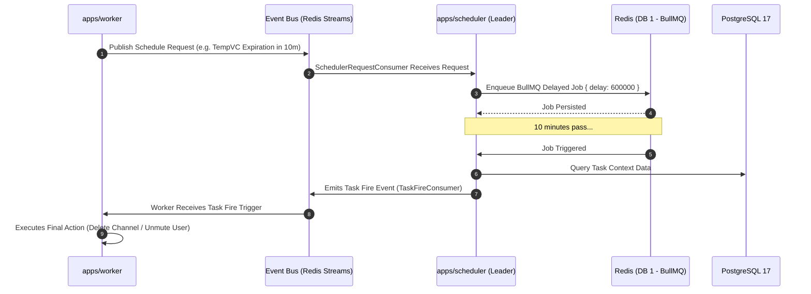

# ⏰ @lumi/scheduler

<div align="center">
  
  
  
  
  
</div>

<br />

The **Lumi Scheduler** (`@lumi/scheduler`) is a specialized, headless background worker responsible for managing delayed jobs, recurring cron tasks, and time-based module effects across the Lumi ecosystem.

---

## 📖 Table of Contents

- [Overview](#-overview)
- [Architecture & Data Flow](#-architecture--data-flow)
- [Configuration & Environment Variables](#-configuration--environment-variables)
- [Development & Running Instructions](#-development--running-instructions)
- [Observability & Health Probes](#-observability--health-probes)

---

## 🌟 Overview

The scheduler service guarantees accurate execution of time-sensitive operations (e.g., temporary voice channel expiration, delayed moderation mutes/bans, scheduled user reminders):

- **Headless & WS-Free Operation**: Does not open or maintain Discord Gateway WebSocket connections, preserving token gateway identify limits.
- **BullMQ Task Queue Engine**: Backed by **BullMQ** (using Redis DB index `1`), handling exponential backoff retries, job deduplication, and delayed triggers.
- **Distributed Leader Election**: Supports optional Redis-based active/passive leader locking (`SCHEDULER_LEADER_LOCK=true`) to enable high-availability (HA) multi-replica deployments without duplicate task execution.
- **Event Bus Consumer Interface**: Listens for schedule and unschedule requests via `SchedulerRequestConsumer` emitted by worker nodes.
- **Task Fire Event Dispatcher**: Emits task fire notifications (`TaskFireConsumer`) over the event bus when scheduled timers trigger, allowing worker nodes to execute final Discord side-effects.

> [!NOTE]
> In production environments with multiple scheduler instances, enable `SCHEDULER_LEADER_LOCK=true`. Only the active leader replica processes queue items, while standby replicas maintain readiness.

---

## 🏗️ Architecture & Data Flow

### Task Scheduling Lifecycle



---

## ⚙️ Configuration & Environment Variables

Configure `@lumi/scheduler` using environment variables:

| Environment Variable | Required | Default | Description |
|---|:---:|:---:|---|
| `BOT_TOKEN` | **Yes** | - | Discord Bot Token (used for Sapphire framework initialisation). |
| `LUMI_ROLE` | **Yes** | `scheduler` | Identifies the process role (`scheduler`). |
| `SCHEDULER_LEADER_LOCK` | No | `false` | Enables Redis leader election for HA deployments. |
| `SCHEDULER_LEADER_LOCK_TTL_MS` | No | `30000` | Lease duration in milliseconds for the leader key lock. |
| `SCHEDULER_LEADER_LOCK_RENEW_MS` | No | `10000` | Renewal heartbeat interval for the active leader. |
| `REDIS_HOST` | No | `localhost` | Redis server hostname. |
| `REDIS_PORT` | No | `6379` | Redis server network port. |
| `REDIS_PASSWORD` | No | - | Redis authentication password. |
| `REDIS_TASK_DB` | No | `1` | Redis database index used exclusively for BullMQ task queues. |
| `RABBITMQ_URL` | **Yes** | - | RabbitMQ broker URL for background task consumer channels. |
| `POSTGRES_URL` | **Yes** | - | PgBouncer or Postgres database connection string. |
| `METRICS_ENABLED` | No | `true` | Enables HTTP metrics and health check server. |
| `METRICS_PORT` | No | `9090` | Network port for Prometheus metrics and health probes. |

> [!TIP]
> Ensure `REDIS_TASK_DB` is kept isolated (default: `1`) from general caching (`REDIS_CACHE_DB`: `0`) to prevent cache flush commands from purging active scheduled tasks.

---

## 🚀 Development & Running Instructions

### Local Development

Ensure PostgreSQL, Redis, and RabbitMQ are available:

```bash
# Set environment variables and launch scheduler
BOT_TOKEN="your-discord-bot-token" LUMI_ROLE="scheduler" bun apps/scheduler/src/main.ts
```

### Docker Compose

Launch the scheduler as part of the scaled production profile:

```bash
docker compose --profile scale up -d scheduler
```

---

## 📊 Observability & Health Probes

The scheduler exposes an HTTP server on `METRICS_PORT` (default `9090`).

### Endpoint Reference

| Endpoint | Method | Status Code | Description |
|---|---|:---:|---|
| `/healthz` | `GET` | `200` | Liveness check for the process. |
| `/readyz` | `GET` | `200` / `503` | Evaluates system probes (`postgres`, `redis`, `rabbitmq`, `scheduler-tasks`, `scheduler-leader`). |
| `/metrics` | `GET` | `200` | Exports Prometheus metrics including `lumi_failed_jobs_total` and queue lengths. |

### Registered Readiness Probes

- `postgres`: Confirms database query execution (`SELECT 1`).
- `redis`: Verifies Redis connectivity (`PING` -> `PONG`).
- `rabbitmq`: Verifies RabbitMQ channel connection status.
- `scheduler-tasks`: Confirms BullMQ task container initialization.
- `scheduler-leader`: Validates leadership ownership when `SCHEDULER_LEADER_LOCK=true`.
