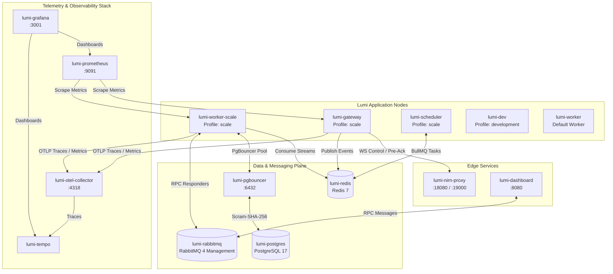
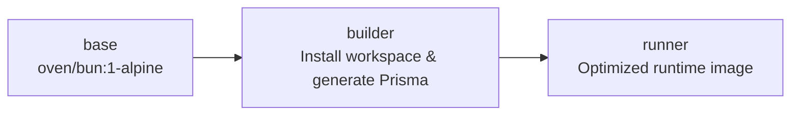

# 🐳 Lumi Docker & Container Deployment

<div align="center">
  
  
  
  
</div>

<br />

This directory documents the containerization strategy, **Dockerfile multi-stage build system**, and **Docker Compose topology** for running Lumi in single-node development, multi-service scaled production, or observability-enabled environments.

---

## 📖 Table of Contents

- [Overview & Container Architecture](#-overview--container-architecture)
- [Dockerfile Multi-Stage Target Pipeline](#-dockerfile-multi-stage-target-pipeline)
- [Docker Compose Services & Profiles](#-docker-compose-services--profiles)
- [Configuration & Environment Variables](#-configuration--environment-variables)
- [Execution & Operation Commands](#-execution--operation-commands)
- [Observability Stack Setup](#-observability-stack-setup)

---

## 🌟 Overview & Container Architecture

Lumi's container setup provides complete flexibility: run a simple single-container bot monolith or launch a fully orchestrated 10+ container microservices stack with rate-limiting proxies, event streams, database connection pooling, and OpenTelemetry tracing.

### Docker Compose Architecture Diagram



---

## 🏗️ Dockerfile Multi-Stage Target Pipeline

The root [`Dockerfile`](../../Dockerfile) uses a 3-stage optimization pipeline based on `oven/bun:1-alpine`:



### Stage Summary

1. **`base`**: Installs minimal Alpine utilities (`git`, `dumb-init`).
2. **`builder`**: Copies workspace `package.json` files, source code, and Prisma schema; executes `bun install` + `bunx prisma generate`.
3. **`runner`**: Copies built dependencies including the full `prisma/` directory and `prisma.config.ts`, mounts `/app/data` for addons, switches to unprivileged user `bun`, and executes production main targets.

---

## 📑 Docker Compose Services & Profiles

Services are organized into distinct Compose **profiles** so you only run what you need.

| Service Name | Profile | Ports / Interfaces | Description |
|---|---|---|---|
| `worker` | *(default)* | - | Default Lumi bot process (`LUMI_ROLE=monolith`). Runs gateway, workers, and scheduler in a single process. |
| `lumi-dev` | `development` | - | Interactive development container with live volume mounts and watch mode. |
| `gateway` | `scale` | - | Standalone Gateway edge service for Discord WebSockets. |
| `worker-scale` | `scale` | - | Scaled Worker node reading events from Redis Streams (`LUMI_ROLE=worker`). |
| `scheduler` | `scale` | - | Task Scheduler managing BullMQ background tasks. |
| `dashboard` | `dashboard` | `8080:8080` | Web Administration Dashboard UI. |
| `postgres` | *(core)* | `127.0.0.1:5432:5432` | PostgreSQL 17 primary database server. |
| `pgbouncer` | *(core)* | `127.0.0.1:6432:6432` | PgBouncer transaction-level connection pooler. |
| `redis` | *(core)* | `127.0.0.1:6379:6379` | Redis 7 data store for entity caching and event streams. |
| `rabbitmq` | *(core)* | `127.0.0.1:5672`, `:15672` | RabbitMQ 4 broker with Management UI. |
| `nirn-proxy` | `scale` | `127.0.0.1:18080`, `:19000` | Discord REST rate-limiting proxy. |
| `otel-collector` | `observability` | `127.0.0.1:4318:4318` | OpenTelemetry Collector endpoint (OTLP HTTP). |
| `prometheus` | `observability` | `127.0.0.1:9091:9090` | Prometheus metrics collector and alerting engine. |
| `tempo` | `observability` | - | Grafana Tempo distributed tracing storage engine. |
| `grafana` | `observability` | `127.0.0.1:3001:3000` | Grafana metrics and trace visualization dashboard. |

---

## ⚙️ Configuration & Environment Variables

Copy `.env.example` to `.env` in the project root before launching Docker containers:

```bash
cp .env.example .env
```

### Core Environment Variables

| Variable | Default | Purpose |
|---|---|---|
| `BOT_TOKEN` | - | Discord Bot Token (Required). |
| `POSTGRES_USER` | `lumi` | PostgreSQL database username. |
| `POSTGRES_PASSWORD` | `lumi` | PostgreSQL database password. |
| `REDIS_PASSWORD` | `lumi` | Redis password authentication. |
| `RABBITMQ_USER` | `lumi` | RabbitMQ username. |
| `RABBITMQ_PASSWORD` | `lumi` | RabbitMQ password. |
| `DASHBOARD_SESSION_SECRET` | - | Secret key for dashboard session cookies. |
| `DISCORD_OAUTH2_CLIENT_ID` | - | OAuth2 Client ID for dashboard authentication. |
| `DISCORD_OAUTH2_CLIENT_SECRET` | - | OAuth2 Client Secret for dashboard authentication. |
| `DISCORD_OAUTH2_REDIRECT_URI` | - | OAuth2 Redirect URI for dashboard login. |
| `OTEL_ENABLED` | `true` | Enables OpenTelemetry tracing exporters. |
| `GRAFANA_PASSWORD` | `admin` | Admin password for Grafana web UI. |

---

## 🚀 Execution & Operation Commands

### 1. Default Stack

Run Lumi in single-container mode alongside PostgreSQL, PgBouncer, Redis, and RabbitMQ:

```bash
docker compose up -d
```

### 2. Development Stack

Run the hot-reloading development container with interactive logs:

```bash
docker compose --profile development up
```

### 3. Scaled Production Microservices Stack

Launch Gateway, Worker, Scheduler, Dashboard, and Rate-Limit Proxy:

```bash
docker compose --profile scale --profile dashboard up -d
```

### 4. Stopping Containers

```bash
# Stop active services
docker compose down

# Stop services and remove persistent volume data
docker compose down -v
```

---

## 📊 Observability Stack Setup

Launch the complete OpenTelemetry + Prometheus + Grafana telemetry stack:

```bash
docker compose --profile observability up -d
```

### Web Interfaces Access

- **Grafana Dashboards**: `http://localhost:3001` (User: `admin`, Password: `${GRAFANA_PASSWORD:-admin}`)
- **Prometheus UI**: `http://localhost:9091`
- **RabbitMQ Management**: `http://localhost:15672` (User: `lumi`, Password: `lumi`)
- **Nirn-Proxy Metrics**: `http://localhost:19000`
