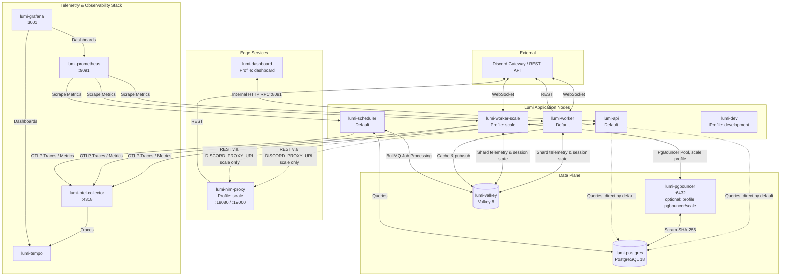
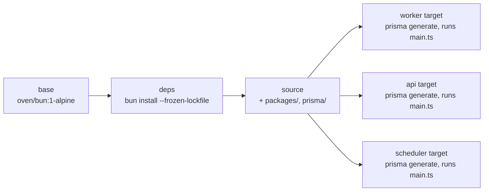

# 🐳 Lumi Docker & Container Deployment

<div align="center">
  
  
  
  
</div>

<br />

This directory documents the containerization strategy, **Dockerfile multi-stage build system**, and **Docker Compose topology** for running Lumi in single-node development, multi-service scaled production, or observability-enabled environments.

---

## 📖 Table of Contents

- [Overview & Container Architecture](#-overview--container-architecture)
- [Dockerfile Multi-Stage Target Pipeline](#-dockerfile-multi-stage-target-pipeline)
- [Docker Compose Services & Profiles](#-docker-compose-services--profiles)
- [Configuration & Environment Variables](#-configuration--environment-variables)
- [Execution & Operation Commands](#-execution--operation-commands)
- [Database Migrations](#-database-migrations)
- [Deployment Tiers](#-deployment-tiers)
- [Backups & Restore Testing](#-backups--restore-testing)
- [Observability Stack Setup](#-observability-stack-setup)

---

## 🌟 Overview & Container Architecture

Lumi's container setup provides complete flexibility: run a single bot container against the core data plane, or launch a fully orchestrated stack with extra worker replicas, a scheduler, a dashboard, and OpenTelemetry tracing.

Every worker process is identical: `apps/worker/src/main.ts` is a lightweight discord.js `ShardingManager` that spawns one child process per shard it owns, each child holding a real Discord WebSocket connection and running all command, module, and interaction logic in-process. Job scheduling is owned by a separate, gateway-free `scheduler` service that runs the BullMQ worker and manages repeatable jobs. RPC serving lives in a separate, gateway-free `api` service (default compose service, like `worker`) that the dashboard talks to instead. A single worker tracks its own Discord REST rate-limit buckets; once you run more than one, the `scale` profile adds **nirn-proxy** as a shared REST proxy so those buckets stay coordinated across processes (`DISCORD_PROXY_URL`).

### Docker Compose Architecture Diagram


```mermaid
flowchart TD
    subgraph External
        Discord[Discord Gateway / REST API]
    end

    subgraph Edge Services
        NP[lumi-nirn-proxy<br/>Profile: scale<br/>:18080 / :19000]
        Dash[lumi-dashboard<br/>Profile: dashboard]
    end

    subgraph Lumi Application Nodes
        W[lumi-worker<br/>Default]
        WS[lumi-worker-scale<br/>Profile: scale]
        Api[lumi-api<br/>Default]
        Sched[lumi-scheduler<br/>Default]
        Dev[lumi-dev<br/>Profile: development]
    end

    subgraph Data Plane
        PGB[lumi-pgbouncer<br/>:6432<br/>optional: profile pgbouncer/scale]
        PG[(lumi-postgres<br/>PostgreSQL 18)]
        V[(lumi-valkey<br/>Valkey 8)]
    end

    subgraph Telemetry & Observability Stack
        OTEL[lumi-otel-collector<br/>:4318]
        Prom[lumi-prometheus<br/>:9091]
        Tempo[lumi-tempo]
        Graf[lumi-grafana<br/>:3001]
    end

    Discord <-->|WebSocket| W
    Discord <-->|WebSocket| WS
    W -->|REST| Discord
    NP -->|REST| Discord

    W -.->|REST via DISCORD_PROXY_URL<br/>scale only| NP
    WS -.->|REST via DISCORD_PROXY_URL<br/>scale only| NP

    W <-->|Shard telemetry & session state| V
    WS <-->|Shard telemetry & session state| V
    W -.->|Queries, direct by default| PG
    WS <-->|PgBouncer Pool, scale profile| PGB
    PGB <-->|Scram-SHA-256| PG

    Dash <-->|Internal HTTP RPC :8091| Api
    Api -.->|Queries, direct by default| PG
    Api <-->|Cache & pub/sub| V

    Sched <-->|BullMQ Job Processing| V
    Sched <-->|Queries| PG

    W -->|OTLP Traces / Metrics| OTEL
    WS -->|OTLP Traces / Metrics| OTEL
    Sched -->|OTLP Traces / Metrics| OTEL
    OTEL -->|Traces| Tempo
    Prom -->|Scrape Metrics| W
    Prom -->|Scrape Metrics| WS
    Prom -->|Scrape Metrics| Sched
    Graf -->|Dashboards| Prom
    Graf -->|Dashboards| Tempo
```

---

## 🏗️ Dockerfile Multi-Stage Target Pipeline

The root [`Dockerfile`](../../Dockerfile) uses one shared dependency chain that then branches into
multiple independent final targets based on `oven/bun:1-alpine`:


```mermaid
graph LR
    base[base<br/>oven/bun:1-alpine] --> deps[deps<br/>bun install --frozen-lockfile]
    deps --> source[source<br/>+ packages/, prisma/]
    source --> worker[worker target<br/>prisma generate, runs main.ts]
    source --> api[api target<br/>prisma generate, runs main.ts]
    source --> scheduler[scheduler target<br/>prisma generate, runs main.ts]
```

The dashboard is built and published from its own repo,
[`lumi-devs/lumi-dashboard`](https://github.com/lumi-devs/lumi-dashboard), as
`ghcr.io/lumi-devs/lumi-dashboard` — it has no target in this Dockerfile.

### Stage Summary

1. **`base`**: Installs minimal Alpine utilities (`dumb-init`).
2. **`deps`**: Copies every workspace `package.json` and runs `bun install --frozen-lockfile`.
3. **`source`**: Adds `tsconfig`/`prisma.config.ts`, the `packages/` workspaces, and the Prisma
   schema — shared by all final targets below.
4. **`worker`** (`docker compose build` target `worker`): adds `apps/worker/`, runs
   `bunx prisma generate`, switches to unprivileged user `bun`, and on container start runs
   `bun apps/worker/src/main.ts` directly - no migration step. There is no separate `migrate`
   image/target: the compose `migrate` service and the k8s `migrate` `Job` both reuse this same
   `worker`-target image, just with a `command` override (`bunx prisma migrate deploy` against
   `DIRECT_POSTGRES_URL`) instead of the default `CMD` - a distinct image tag would otherwise
   race the worker image for the same name on `compose build`, and pull-only users (CI doesn't
   publish a `migrate` image) would get the worker image with no override, which never exits.
5. **`api`** (`docker compose build` target `api`): adds `apps/api/`, runs `bunx prisma generate`,
   switches to unprivileged user `bun`, and on container start runs `bun apps/api/src/main.ts`.
6. **`scheduler`** (`docker compose build` target `scheduler`): adds `apps/scheduler/`, runs
   `bunx prisma generate`, switches to unprivileged user `bun`, and on container start runs
   `bun apps/scheduler/src/main.ts`.

The `dashboard` compose service pulls its image (`ghcr.io/lumi-devs/lumi-dashboard`) straight
from GHCR rather than building it — that image is built by the `lumi-dashboard` repo's own
CI, not this Dockerfile.

---

## 📑 Docker Compose Services & Profiles

Services are organized into distinct Compose **profiles** so you only run what you need.

| Service Name | Profile | Ports / Interfaces | Description |
|---|---|---|---|
| `migrate` | *(default)* | - | One-shot `bunx prisma migrate deploy`, then exits. `worker`/`worker-scale`/`api`/`scheduler` wait on it (`depends_on: condition: service_completed_successfully`) instead of each running migrations on their own startup. |
| `worker` | *(default)* | - | Default Lumi bot process. `ShardingManager` spawns one child per shard; runs all commands, interactions, and listeners. |
| `scheduler` | *(default)* | - | BullMQ job scheduler and worker process - no Discord gateway connection, no RPC serving. |
| `api` | *(default)* | - | Stateless internal RPC server for the dashboard - no Discord gateway connection, no job scheduling. |
| `lumi-dev` | `development` | - | Interactive development container with live volume mounts and watch mode. |
| `worker-scale` | `scale` | - | Additional worker replica claiming its own shard range. Points `POSTGRES_URL` at `pgbouncer:6432` (extra replicas mean extra DB connections). |
| `dashboard` | `dashboard` | `8080:8080` | Web Administration Dashboard UI, pulled from `ghcr.io/lumi-devs/lumi-dashboard` (built in its own repo). |
| `postgres` | *(core)* | `127.0.0.1:5432:5432` | PostgreSQL 18 primary database server. |
| `pgbouncer` | `pgbouncer`, `scale` | `127.0.0.1:6432:6432` | PgBouncer transaction-level connection pooler. Opt-in - see [Deployment Tiers](#-deployment-tiers) below. |
| `valkey` | *(core)* | `127.0.0.1:6379:6379` | Valkey 8 data store for entity caching and event streams. |
| `nirn-proxy` | `scale` | `127.0.0.1:18080`, `:19000` | Shared Discord REST rate-limiting proxy for multi-worker runs. |
| `backup` | `backup` | - | Periodic `pg_dump -Fc` against `postgres` directly (never PgBouncer). Opt-in - see [Backups & Restore Testing](#-backups--restore-testing). |
| `otel-collector` | `observability` | `127.0.0.1:4318:4318` | OpenTelemetry Collector endpoint (OTLP HTTP). |
| `prometheus` | `observability` | `127.0.0.1:9091:9090` | Prometheus metrics collector and alerting engine. |
| `tempo` | `observability` | - | Grafana Tempo distributed tracing storage engine. |
| `grafana` | `observability` | `127.0.0.1:3001:3000` | Grafana metrics and trace visualization dashboard. |

---

## ⚙️ Configuration & Environment Variables

Copy `.env.example` to `.env` in the project root before launching Docker containers:

```bash
cp .env.example .env
```

### Core Environment Variables

| Variable | Default | Purpose |
|---|---|---|
| `BOT_TOKEN` | - | Discord Bot Token (Required). |
| `POSTGRES_USER` | `lumi` | PostgreSQL database username. |
| `POSTGRES_PASSWORD` | `lumi` | PostgreSQL database password. |
| `POSTGRES_URL` | `postgresql://...@postgres:5432/lumi` | Pooled/app connection string. Defaults straight to `postgres` (no pooler). Override to `postgresql://...@pgbouncer:6432/lumi` when the `pgbouncer` profile is enabled - see [Deployment Tiers](#-deployment-tiers). |
| `DIRECT_POSTGRES_URL` | `postgresql://...@postgres:5432/lumi` | Always points straight at `postgres`, never PgBouncer - Prisma migrations (`migrate` service) need DDL that pooled/transaction-mode connections can't run reliably. |
| `VALKEY_PASSWORD` | `lumi` | Valkey password authentication. |
| `RPC_HTTP_PORT` | `8091` | Internal HTTP RPC server port the api service binds - never published to the host. |
| `RPC_HTTP_URL` | `http://api:8091` | Internal RPC bridge URL the dashboard calls into the api service over. |
| `DASHBOARD_SESSION_SECRET` | - | NextAuth session JWT signing/encryption secret. |
| `DISCORD_OAUTH2_CLIENT_ID` | - | OAuth2 Client ID for dashboard authentication. |
| `DISCORD_OAUTH2_CLIENT_SECRET` | - | OAuth2 Client Secret for dashboard authentication. |
| `AUTH_URL` | *(derived)* | Dashboard's externally visible origin. Only needed behind a proxy that rewrites the Host header. |
| `DISCORD_PROXY_URL` | *(empty)* | Shared Discord REST proxy endpoint. Set to `http://nirn-proxy:8080` under the `scale` profile; leave empty for single-worker runs. |
| `OTEL_ENABLED` | `true` | Enables OpenTelemetry tracing exporters. |
| `GRAFANA_PASSWORD` | `admin` | Admin password for Grafana web UI. |

---

## 🚀 Execution & Operation Commands

### 1. Default Stack

Run a single worker alongside PostgreSQL and Valkey (no PgBouncer - `migrate` runs once and exits before `worker`/`api` start):

```bash
docker compose up -d
```

### 2. Development Stack

Run the hot-reloading development container with interactive logs:

```bash
docker compose --profile development up
```

### 3. Scaled Production Stack

Launch a second worker replica plus PgBouncer (also set `POSTGRES_URL` to the pgbouncer value in `.env` for the `worker`/`api` services if you want them pooled too - `worker-scale` already points there by default):

```bash
docker compose --profile scale up -d
```

> [!NOTE]
> There is no OAuth2 redirect-URI variable. NextAuth derives the callback from the request; register `<dashboard-origin>/api/auth/callback/discord` on your Discord application.

### 4. Stopping Containers

```bash
# Stop active services
docker compose down

# Stop services and remove persistent volume data
docker compose down -v
```

---

## 🧬 Database Migrations

`worker`/`worker-scale`/`api` no longer run `prisma migrate deploy` on their own startup - a
dedicated one-shot `migrate` service runs it once and exits, and the app services wait on it
(`depends_on: migrate: condition: service_completed_successfully`). This replaces every replica
racing the same migration on every restart. `migrate` reuses the same image/build as `worker`
(`target: worker`) with a `command` override rather than its own image or Dockerfile target -
a distinct `migrate` image would race the worker image for the same tag on `compose build`, and
pull-only users (CI doesn't publish a separate `migrate` image) would otherwise get the worker
image with no command override, which runs the bot forever and never completes.

- **Compose**: `docker compose up -d` runs `migrate` automatically before `worker`/`api` start.
  To run it standalone (e.g. to check exit status, or before a rolling update): `docker compose
  run --rm migrate`.
- **Single-container `docker run` users** (no Compose): the image no longer migrates itself, so
  run migrations explicitly once before starting the app container:
  ```bash
  docker run --rm --env-file .env ghcr.io/lumi-devs/lumi:latest bunx prisma migrate deploy
  docker run -d --env-file .env --name lumi-worker ghcr.io/lumi-devs/lumi:latest
  ```
- **Kubernetes**: unchanged - `deploy/k8s/migrate-job.yaml` is already a separate `batch/v1` Job
  applied before the `worker`/`api` Deployments (see `deploy/k8s/README.md`).

---

## 🧱 Deployment Tiers

Three tiers, reusing the same `Dockerfile`/`docker-compose.yml`/`deploy/k8s/` artifacts rather
than separate `docker-compose.*.yml` files per tier:

| Tier | What it is | How to run |
|---|---|---|
| **Single-node** | One VPS, one bot process, no pooler. `POSTGRES_URL` defaults straight to `postgres:5432`. | `docker compose up -d` |
| **Production** | Single node, but with the web dashboard and/or PgBouncer in front of Postgres for connection pooling. | `docker compose --profile dashboard --profile pgbouncer up -d`, with `POSTGRES_URL` in `.env` set to `postgresql://...@pgbouncer:6432/lumi` for any service you want pooled |
| **Cluster** | Multiple worker replicas (static shard partitioning), horizontal `api` scaling, Kubernetes-managed. | `deploy/k8s/*.yaml` - see [`deploy/k8s/README.md`](../k8s/README.md). The `scale`/`pgbouncer` Compose profiles are the local equivalent for testing multi-replica behavior before moving to k8s. |

The `scale` profile (`docker compose --profile scale up -d`) sits between production and
cluster: it adds a second `worker-scale` replica, `nirn-proxy` (shared Discord REST rate-limit
coordination), and PgBouncer (since extra replicas mean extra DB connections) - all still in one
compose file, opted into by profile rather than a separate compose stack.

---

## 💾 Backups & Restore Testing

The `backup` profile runs a long-lived container (`deploy/backup/backup.sh`) that dumps the
database on a loop, connecting straight to `postgres` (never PgBouncer, since `pg_dump` needs a
direct, non-pooled connection). Dumps are `pg_dump -Fc` (custom format, `pg_restore`-only),
written atomically (`.tmp` then renamed) to the `backup-data` volume as
`lumi-<UTC-timestamp>.dump`, with old dumps pruned by count.

| Variable | Default | Purpose |
|---|---|---|
| `BACKUP_RETENTION` | `7` | Number of dumps to keep; older ones are deleted after each successful dump. |
| `BACKUP_INTERVAL_HOURS` | `24` | Hours between dumps. |

These are Compose-only knobs for the `backup` service - the worker/api/scheduler processes never
read them, so they aren't part of `.env.example`'s app configuration.

```bash
# Start the recurring backup loop
docker compose --profile backup up -d backup

# One-off dump on demand
docker compose --profile backup run --rm backup /scripts/backup.sh once

# Verify the latest dump actually restores: creates a throwaway
# lumi_restore_test_<timestamp> database, runs `pg_restore --exit-on-error`,
# checks _prisma_migrations exists and has rows, prints the restored table
# count, then drops the temporary database.
docker compose --profile backup run --rm backup /scripts/restore-test.sh

# Restore a specific dump instead of the latest one
docker compose --profile backup run --rm backup /scripts/restore-test.sh /backups/lumi-20260101T000000Z.dump
```

To restore into the real `lumi` database after a disaster (stop the app services first so
nothing writes during the restore):

```bash
docker compose stop worker worker-scale api scheduler
docker compose --profile backup run --rm backup \
  pg_restore --exit-on-error -h postgres -U "${POSTGRES_USER:-lumi}" -d lumi --clean --if-exists \
  /backups/lumi-20260101T000000Z.dump
docker compose up -d
```

See [`deploy/backup/`](../backup/) for the scripts, and
[`deploy/k8s/README.md`](../k8s/README.md#backups--restore-testing) for the Kubernetes
`CronJob` equivalent.

---

## 📊 Observability Stack Setup

Launch the complete OpenTelemetry + Prometheus + Grafana telemetry stack:

```bash
docker compose --profile observability up -d
```

### Web Interfaces Access

- **Grafana Dashboards**: `http://localhost:3001` (User: `admin`, Password: `${GRAFANA_PASSWORD:-admin}`)
- **Prometheus UI**: `http://localhost:9091`
- **Nirn-Proxy Metrics**: `http://localhost:19000`
