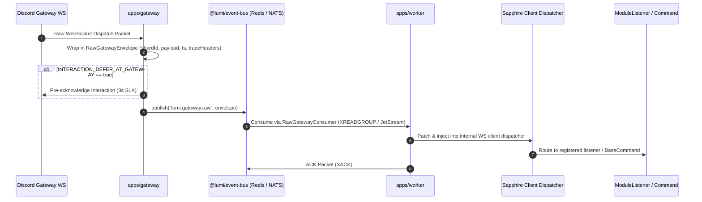
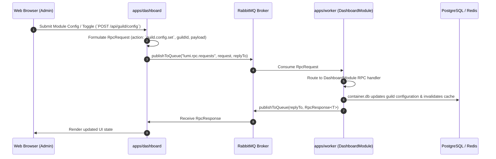
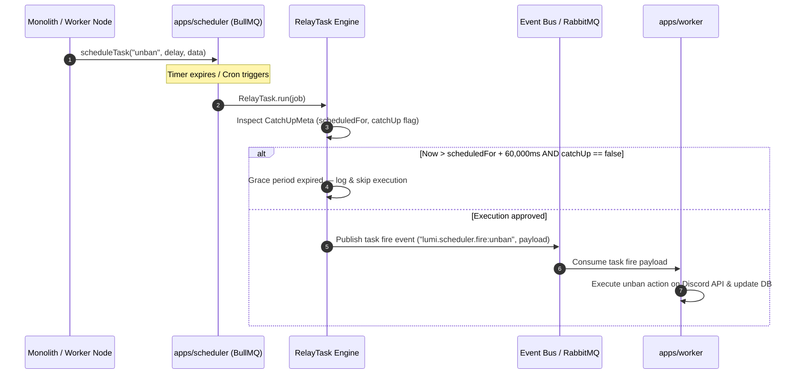

# Lumi-TS Architecture Guide

> Technical specification of Lumi-TS microservices topology, event streaming, RPC communication flows, background job catch-up policies, and monorepo package structure.

---

## 🏛️ Microservices Topology Overview

Lumi-TS is architected as a hybrid monorepo capable of running in a unified single-process mode (`monolith`) or as a decoupled cluster of dedicated microservices.

```
                           ┌──────────────────────────┐
                           │   Discord Gateway WS     │
                           └─────────────┬────────────┘
                                         │
                                         ▼
                                ┌─────────────────┐
                                │  apps/gateway   │
                                └────────┬────────┘
                                         │ (@lumi/event-bus)
                                         │ Redis Streams / NATS JetStream
                                         ▼
                                ┌─────────────────┐
  ┌──────────────────┐  RPC     │   apps/worker   │ ◄── Task Fire Events
  │  apps/dashboard  ├─────────►│   (Stateless)   │ (lumi.scheduler.fire)
  └──────────────────┘ RabbitMQ └────────┬────────┘
                                         │
                                         ▼
                               ┌───────────────────┐
                               │ PostgreSQL / Redis│
                               └───────────────────┘
                                         ▲
                                         │ BullMQ Queue
                                ┌────────┴─────────┐
                                │  apps/scheduler  │
                                └──────────────────┘
```

### Runtime Roles (`LUMI_ROLE`)

| Role | WS Connection | Scheduled Tasks | Event Bus Transport | Description |
|---|---|---|---|---|
| `monolith` | ✅ | ✅ (BullMQ) | `inproc` | Single unified process for local dev and small-to-medium deployments. |
| `gateway` | ✅ | ❌ | `streams` / `nats` | Manages Discord WebSocket shards and streams dispatch envelopes. Zero command logic. |
| `worker` | ❌ | ❌ | `streams` / `nats` / `inproc` | Stateless event consumer executing command logic, module listeners, and RPC. |
| `scheduler` | ❌ | ✅ (BullMQ) | `streams` / `nats` / `inproc` | Owns background job queues, evaluates grace periods, and triggers execution events. |

---

## 🔄 Sequence Flow Diagrams

### 1. Gateway Event Dispatching via `@lumi/event-bus`

When a Discord Gateway event arrives (e.g. `MESSAGE_CREATE`, `INTERACTION_CREATE`), `apps/gateway` wraps the payload into a `RawGatewayEnvelope` and streams it over `@lumi/event-bus` to worker nodes.



---

### 2. Dashboard RPC Workflow via RabbitMQ

The web dashboard (`apps/dashboard`) allows server administrators to configure modules without executing database queries directly. All reads and writes pass through worker nodes using RabbitMQ RPC over queues `lumi.rpc.requests` and temporary reply queues (`amq.rabbitmq.rabbitmq.reply-to`).



---

### 3. BullMQ `RelayTask` Catch-Up Policy

Background jobs (such as unbanning a user when a tempban expires) are scheduled via BullMQ on `apps/scheduler`. Before delegating execution to workers, `RelayTask` evaluates a catch-up grace window (`CatchUpMeta`) to ensure overdue tasks are safely handled or dropped.



---

## 📂 Subpackage Breakdown & Monorepo Structure

The repository is organized into thin deployable applications (`apps/*`) and modular packages (`packages/*`):

### Applications (`apps/`)

- **`apps/dashboard` (`@lumi/dashboard`)**:
  - Stateless browser-based web dashboard.
  - Implements Discord OAuth2 login and surfaces auto-generated module configuration forms.
  - Communicates exclusively via RabbitMQ RPC (`@lumi/contracts`).

- **`apps/gateway` (`@lumi/gateway`)**:
  - Lightweight entrypoint for Discord WebSocket connections.
  - Integrates `@discordjs/ws` and `@lumi/sharding` for cluster coordination.
  - Streams wrapped dispatch packets to `@lumi/event-bus`.

- **`apps/scheduler` (`@lumi/scheduler`)**:
  - Owns BullMQ queue and task runner (`@sapphire/plugin-scheduled-tasks`).
  - Evaluates `RelayTask` grace periods and broadcasts task fire events to workers.

- **`apps/worker` (`@lumi/worker`)**:
  - Stateless event, command, and RPC processing worker node.
  - Scales horizontally (1 to N instances) behind consumer groups.

### Packages (`packages/`)

- **`packages/contracts` (`@lumi/contracts`)**:
  - Shared wire contracts, RPC action constants (`RPC_ACTIONS`), stream topic names, and manifest interfaces. Zero runtime dependencies.

- **`packages/core` (`@lumi/core`)**:
  - Core framework library containing `LumiClient`, module store, `DatabaseService`, card utilities, base commands, permission handlers, and built-in modules (`packages/core/src/modules/`).

- **`packages/event-bus` (`@lumi/event-bus`)**:
  - Transport abstraction layer supporting `inproc` (EventEmitter), `streams` (Redis Streams), and `nats` (NATS JetStream).

- **`packages/observability` (`@lumi/observability`)**:
  - Observability primitives including OpenTelemetry tracing (`startTracing`), Pino logger (`createPinoLogger`), Prometheus metrics (`METRICS_PORT=9090`), and graceful drain sequences.

- **`packages/sdk` (`@lumi/sdk`)**:
  - Public developer SDK re-exporting framework decorators, base commands, cards, and formatting utilities for third-party addon creation.

- **`packages/sharding` (`@lumi/sharding`)**:
  - Redis-backed cluster coordinator (`ClusterCoordinator`), dynamic sharding strategy (`DynamicShardingStrategy`), session store, and identify rate throttler.
