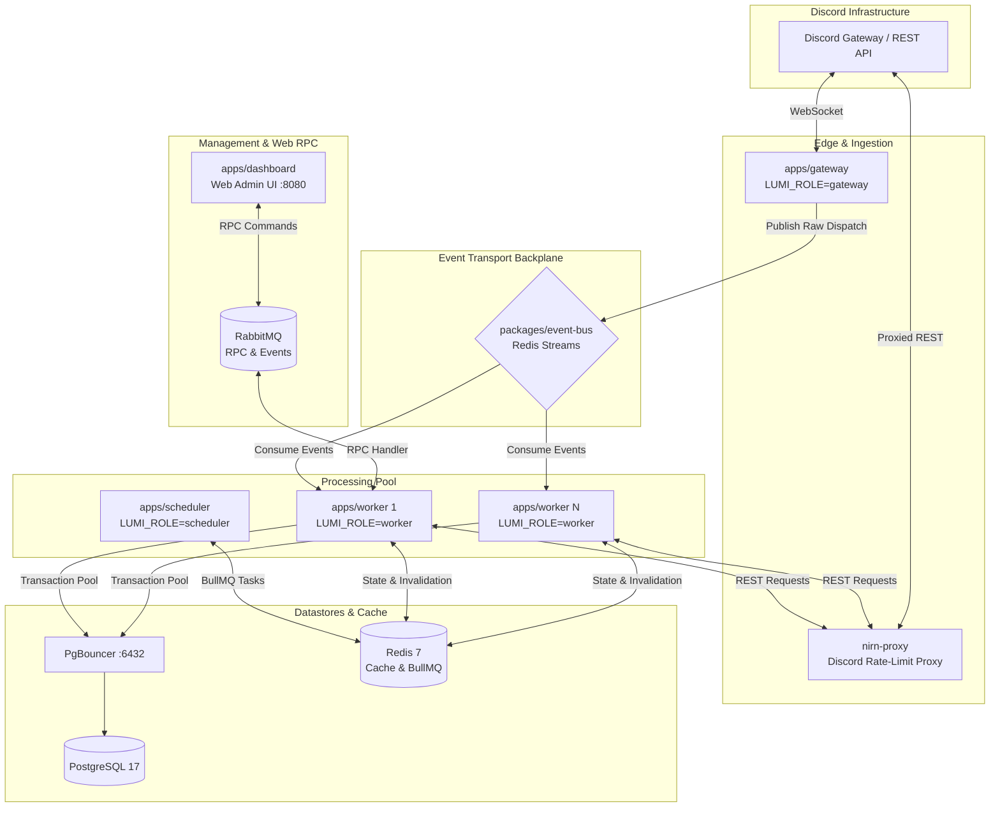
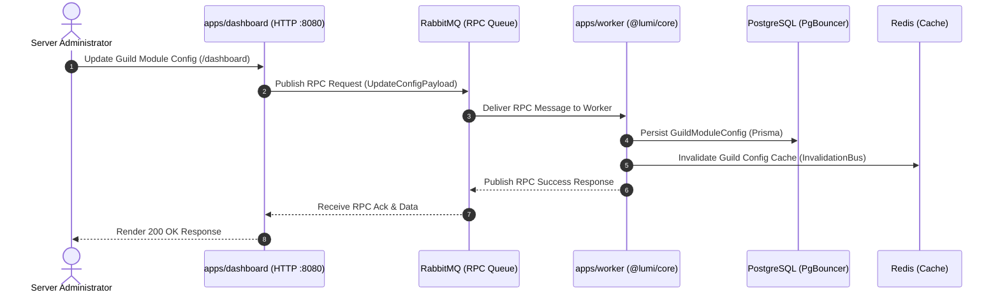

# Architecture & System Topology

Lumi is organized as a unified Bun workspace monorepo separating entrypoint applications (`apps/`) from reusable core packages (`packages/`).

## System Topology

## Dashboard RPC Sequence

## Monorepo Structure

| Category | Package | Purpose |
| :--- | :--- | :--- |
| **Apps** | `apps/worker` | Main execution engine — commands, events, module logic |
| | `apps/gateway` | Discord WebSocket ingestion (`LUMI_ROLE=gateway`) |
| | `apps/scheduler` | Background task scheduler, BullMQ queues |
| | `apps/dashboard` | Web admin panel on `:8080`, Discord OAuth2 |
| **Packages** | `@lumi/core` | Core framework, modules, Prisma models, i18n |
| | `@lumi/event-bus` | Redis Streams event bus |
| | `@lumi/observability` | Pino logger, OpenTelemetry, Prometheus `:9090` |
| | `@lumi/sharding` | Discord cluster coordinator & shard planner |
| | `@lumi/contracts` | Shared TypeScript interfaces, event schemas |
| | `@lumi/sdk` | Developer SDK for external extensions |
