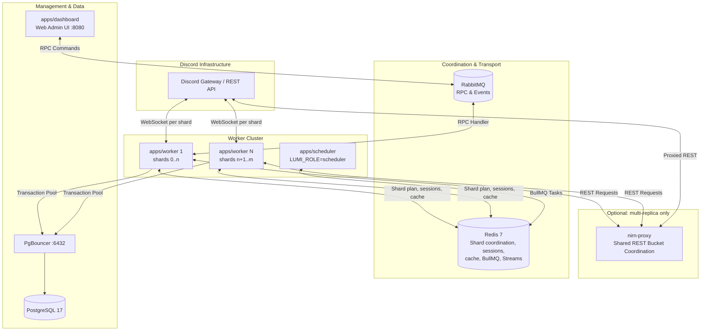
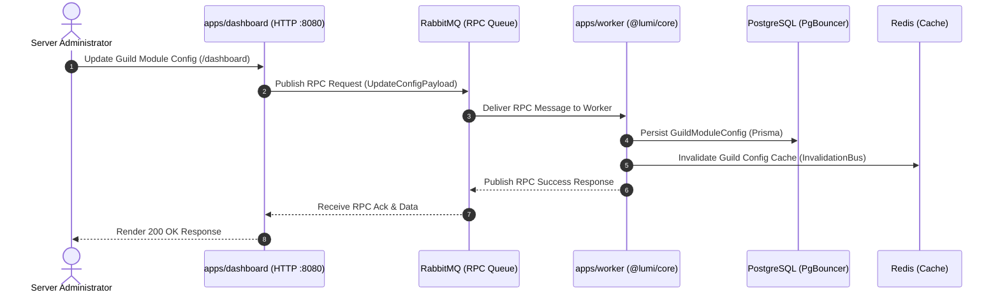

# Architecture & System Topology

Lumi is organized as a unified Bun workspace monorepo separating entrypoint applications (`apps/`) from reusable core packages (`packages/`).

## Two-Process Model

Lumi runs as **two** process roles, selected with `LUMI_ROLE`:

| Role | Responsibility |
| :--- | :--- |
| `worker` (default) | Owns a real Discord Gateway WebSocket connection **and** runs all command, interaction, listener, and module logic in the same process. Also serves the dashboard's RabbitMQ RPC requests. |
| `scheduler` | BullMQ queue owner for scheduled/recurring tasks. No WebSocket connection. |

Gateway ingestion and business logic deliberately live in one process. Lumi previously ran a separate `apps/gateway` process that relayed raw Discord dispatch packets to workers over Redis Streams; the worker replayed them into discord.js's internal `client.ws.handlePacket()`. That method assumes single-process invariants — it expects the client that received the packet to be the client that owns the session, the REST identity, and the interaction lifecycle. Reconstructing client state from another process's packets broke interaction pre-acknowledgement state, left `client.application` unset when Sapphire registered slash commands, and produced two WebSocket sessions competing for one bot token. The relay (`apps/gateway`, `RawGatewayPublisher`, `RawGatewayConsumer`, `RawGatewayEnvelope`) has been removed. Scaling is horizontal instead: many worker processes, each owning a disjoint range of shards.

The event bus remains for the things it is actually good at — the BullMQ/Redis Streams task queue, scheduler RPC, and the dashboard's RabbitMQ RPC bridge. None of these carry live gateway traffic.

## System Topology

## Horizontal Scaling

One worker process is the intended deployment. Scaling past it is a configuration change rather than an architectural one: set `CLUSTER_NAME` and `packages/sharding` takes over coordination. With `CLUSTER_NAME` unset the worker stays on the single-process path with a plain local shard list, and the coordination machinery below stays dormant.

- **Shard plan** — `shard-planner.ts` calls `GET /gateway/bot` at boot for `recommended_shards`, `max_concurrency`, and `session_start_limit`. The shard count is Discord's decision, not a hardcoded constant; the planner refuses to boot when the session-start budget cannot cover the shards it is about to IDENTIFY (`SHARD_IDENTIFY_FORCE` bypasses this for emergencies only).
- **Shard-range assignment** — `ClusterCoordinator.join()` divides the total shard count across the replicas currently in the cluster and hands each replica its own slice. Replica count is the tuning dial (shards per replica), sized against the `shardLatency`, `shardStatus`, `guildCount`, and `eventLoopDelay` gauges exported by `packages/observability`. Because Discord's `(guild_id >> 22) % shard_count` mapping is stable, a guild's traffic always lands on the same replica for as long as that replica owns its shard, so per-guild in-memory state stays naturally local.
- **IDENTIFY throttling** — `RedisIdentifyThrottler` funnels every replica's IDENTIFY through a Redis-held bucket keyed by `shardId % max_concurrency`, so independent processes never collide on a bucket that Discord treats as one logical rate-limit space.
- **Rolling deploys** — `RedisSessionStore` persists each shard's `sessionId`, `sequence`, and `resumeGatewayUrl`, so a replacement process RESUMEs its predecessor's sessions instead of burning a cold IDENTIFY. `ClusterCoordinator.onRebalance` signals a process that cannot reshard in place to drain and exit, letting the orchestrator start a successor that resumes. Note this covers the *session* half only: discord.js rebuilds its guild/member cache from the `GUILD_CREATE` burst that follows a resume, rather than migrating cached state between processes.
- **Command registration** — slash commands are registered globally, once, independent of shard or guild count. A Redis leader lock (the same `SET NX EX` primitive as `SchedulerLeaderLock`) gates Sapphire's `handleRegistryAPICalls()` so only one replica per boot cycle talks to Discord's command REST routes. Every replica still loads its command pieces locally for dispatch — `loadAll()` is unaffected, since Sapphire already skips Discord-side registration when `client.application` is not yet populated.
- **Shared REST rate limits** — Discord's REST limits are per-route and per-bot-global, not per-process. Each replica's local bucket tracking is blind to the others, so multi-replica deployments route REST through `nirn-proxy` via `DISCORD_PROXY_URL`. It is not part of the default stack: it sits behind Docker Compose's `scale` profile, and its Kubernetes manifest is applied only once worker replicas exceed one. `rest429Total` / `restRetryAfterSeconds` catch undersizing before it becomes user-visible.

### Beyond this — a deferred sketch

The dials above (`CLUSTER_NAME`, replica count, shards-per-replica) are what a much larger deployment would turn; nothing about the process shape changes. The notes below are a sketch to re-derive when real guild counts force the question, not settled design.

Past Discord's large-bot sharding threshold the API assigns the shard count outright, so `planShards()` keeps working unchanged and replica count follows from whatever shards-per-replica figure the memory and event-loop headroom actually supports. Gateway *event volume*, not guild count, is what saturates a shard — `PresenceUpdate` and `TypingStart` dominate, so auditing `LumiClient`'s intents against what modules genuinely consume is likely a bigger win than shard tuning. On the data side, PgBouncer covers connection-pool headroom well past that point; because all database access is centralized in the repository classes, adding a read replica later is a change in one layer rather than a query rewrite.

Prior art worth noting, since the removed relay had no precedent in it: YAGPDB's shard orchestrator supervises whole bot processes and exchanges control-plane events with them — it never relays raw gateway payloads. Skyra runs a single `client.login()` process. Red-DiscordBot uses discord.py's `AutoShardedBot`, holding all shards in one process. In every case gateway ingestion and command handling share a process.

## Protecting the Event Loop

One process handles every shard it owns, so anything that blocks the event loop blocks all of them — commands, heartbeats, and gateway acks alike. Two mechanisms exist for that reason.

- **Regex runs off-thread.** Guild-configured filter patterns are attacker-controlled in practice: one catastrophically backtracking pattern, entered by accident or on purpose, would stall every shard on the replica. `lib/regex-worker/` owns a single `node:worker_threads` worker that compiles and runs those patterns; the main thread never holds a `RegExp` built from guild input. Requests are serialized through an `AsyncQueue`, matched by correlation ID, and bounded by a per-evaluation timeout — on expiry the worker is killed and respawned, and the pattern it was running is dropped from that guild's rule set with a logged warning rather than retried on every subsequent message. Patterns are also probed against adversarial inputs when saved (`ConfigService` consults `container.configValueValidators`), so the common case is rejection at config time. Aho-Corasick term matching, invite/link/mention/caps rules are linear in message length and stay inline.
- **Sends nobody waits on are queued.** `lib/outbound/send-queue.ts` routes mod-log entries, security alerts, and logging cards through the existing BullMQ path (`send-message` task → task-fire consumer) instead of an inline REST call, so a Discord outage delays them instead of losing them. The consumer holds one in-flight send per channel, taking YAGPDB's `mqueue` insight that a rate-limited channel should park one slot rather than block a handler; depth is exported as `lumi_queue_depth{queue="outbound-send"}`. Interaction replies are deliberately excluded — they are bounded by Discord's 15-minute token and are the one path a user is actually waiting on. The rule is *if no user is waiting on it, queue it*.

`lumi_event_loop_delay_seconds{quantile="p50"|"p99"|"max"}` (from `perf_hooks.monitorEventLoopDelay`, started in `bootstrapTelemetry`) is the metric to check before tuning any of this. `max` is the one that matters for gateway health: a single multi-second stall drops heartbeats regardless of the median.

## Dashboard RPC Sequence

## Monorepo Structure

| Category | Package | Purpose |
| :--- | :--- | :--- |
| **Apps** | `apps/worker` | Discord WebSocket connection plus all command, event, and module logic (`LUMI_ROLE=worker`) |
| | `apps/scheduler` | Background task scheduler, BullMQ queues (`LUMI_ROLE=scheduler`) |
| | `apps/dashboard` | Web admin panel on `:8080`, Discord OAuth2 |
| **Packages** | `@lumi/core` | Core framework, modules, Prisma models, i18n |
| | `@lumi/event-bus` | Redis Streams task queue & RPC transport |
| | `@lumi/observability` | Pino logger, OpenTelemetry, Prometheus `:9090` |
| | `@lumi/sharding` | Shard planner, cluster coordinator, IDENTIFY throttler, session store |
| | `@lumi/contracts` | Shared TypeScript interfaces, event schemas |
